# EXPLORER : Vulnyx

[Link To : VulNyx | Offensive Security Playground](https://vulnyx.com/#explorer)

## Informasi Mesin

| OS: Linux            |
| -------------------- |
| Creator: d4t4s3c     |
| Difficulty: Easy     |
| Release: 13 Sep 2025 |

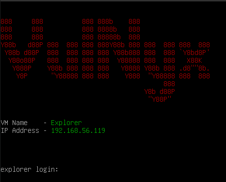

## Scanning Dengan Nmap

```shell
nmap -sCV -p- 192.168.56.119 -oN nmap_scan --min-rate 5000
```

| PORT | STATE | SERVICE |
|:----:|:-----:|:-------:|
| 22   | open  | ssh     |
| 80   | open  | http    |

## Server HTTP

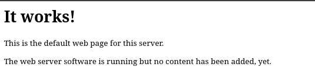

## Enumerasi Dengan Gobuster

> Untuk melakukan enumerasi direktori bisa menggunakan tools selain gobuster

```shell
gobuster dir -w wordlist.txt -u http://192.168.56.119 -r html,php,txt
```

| index.html | Status: 200 |
| ---------- | ----------- |
| robots.txt | Status: 200 |

> hasil dari robots.txt

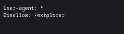

> Memasuki /extplorer pada url akan membawa kita ke login page extplorer

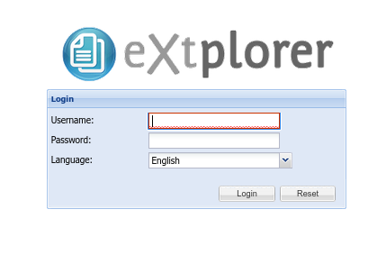

## MENDAPATKAN AKSES KE EXTPLORER

Melakukan searching di google akan default credentials dari extplorer akan mendapat hasil seperti ini

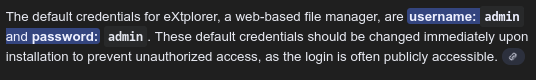

> User: admin | Password: admin

Mencoba login dengan kredensial tersebut akan langsung membawa kita pada halaman utama dari extplorer

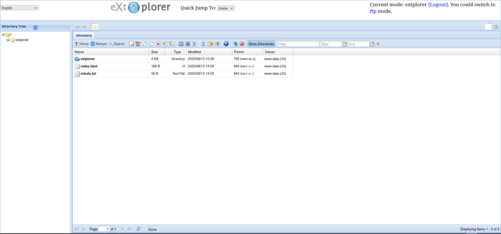

karena kita login sebagai admin, kita bisa melakukan beberapa fitur yang hanya bisa diakses admin seperti menambah user baru. 

## MENDAPATKAN FLAG USER

Jika kita melihat panel admin di extplorer maka akan terlihat pada username 'admin' memiliki home directory di '/var/www/html', dengan ini apakah bisa jika kita menambahkan user baru dengan akses adminstrator di directory '/home' untuk mendapatkan flag user?

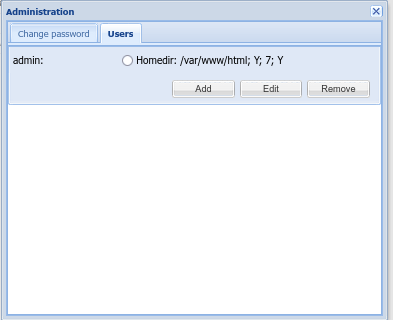

> Tambahkan user baru dengan tombol Add

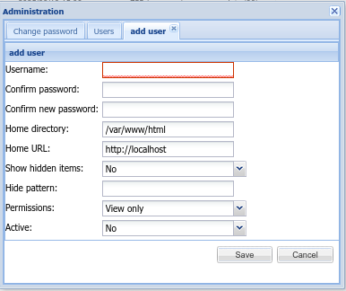

> Isi username dan password

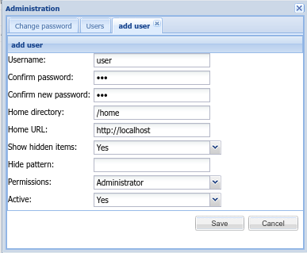

Setelah semuanya selesai, save dan logout lalu login kembali sebagai user yang baru dibuat

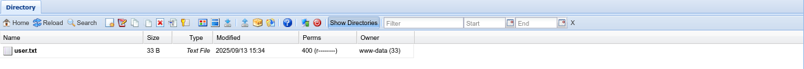

flag user bisa langsung dilihat dan didapatkan pada '/home/user.txt'

## MENDAPATKAN FLAG DAN AKSES ROOT

Melakukan hal yang sama untuk mendapatkan flag root tidak akan berhasil karena saat kembali login tidak akan ada file root.txt seperti sebelumnya. Untuk mendapatkan akses root ini saya mencoba beberapa cara seperti :

1. login melalui ssh dengan 'user: extplorer' dan 'password: extplorer'

2. Membuat user baru dengan akses directory pada '/root' dengan izin sebagai administrator

Tetapi pada direktori '/var/www/html/extplorer/config/config.php', saya menemukan baris ini

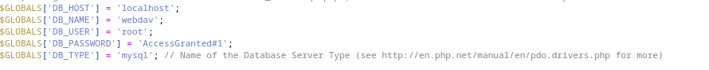

> DB_USER = 'root'
> 
> DB_PASSWORD = 'AccessGranted#1'

Dengan menggunakan kredensial tersebut, saya berhasil login sebagai root di mesin explorer dan mendapatkan flag root pada '/root/root.txt'

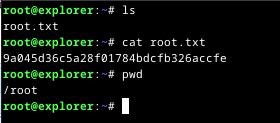
