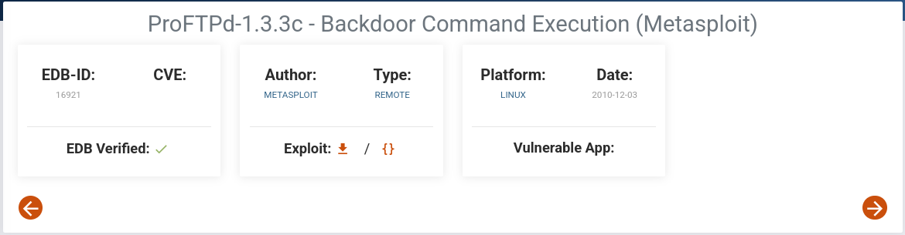
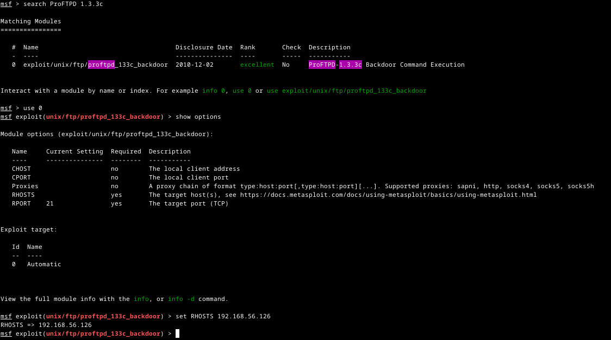
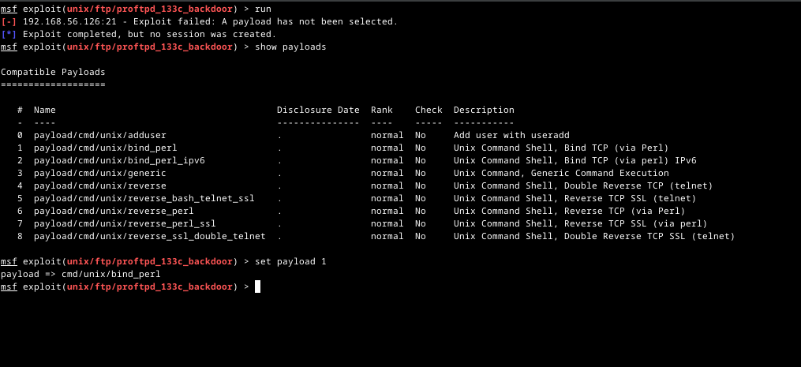
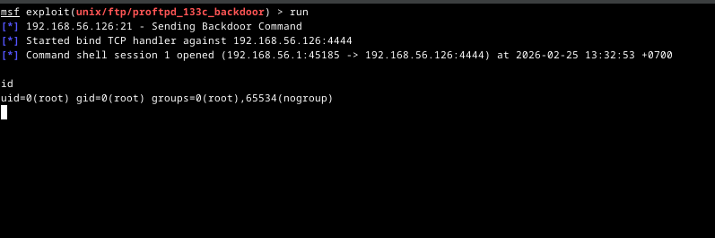

# BASIC PENTESTING: 1 VULNHUB WRITEUP

[Basic Pentesting: 1 ~ VulnHub](https://www.vulnhub.com/entry/basic-pentesting-1,216/)

> Note: Pada mesin ini ada banyak cara untuk mendapatkan akses root

## IP FINDING

`fping -aqg 192.168.xxx.xxx/24`

> Untuk mencari alamat ip target bisa menggunakan tools lain selain fping, semisal netdiscover atau arp scan

## NMAP SCAN

| PORT | STATE | SERVICE |
|:----:|:-----:|:-------:|
| 21   | open  | tcp     |
| 22   | open  | ssh     |
| 80   | open  | http    |

Scan nmap full ada di [sini](nmap.log)

## SEARCHING VULNERABILITY

Gunakan cara paling mudah yaitu mencari vulnerability di exploit-db

## EXPLOITATION & GAINING ROOT ACCESS

Karena ProFTPD sudah diketahui memiliki kerentanan dan exploitnya tersedia di metasploit, langkah berikutnya adalah melakukan exploitasi ke mesin dengan metasploit

> Mesin ini tidak memiliki flag, mendapatkan akses root sudah cukup untuk menandakan mesin sudah ditaklukan.
