# BASIC PENTESTING: 1 VULNHUB WRITEUP

[Basic Pentesting: 2 ~ VulnHub](https://www.vulnhub.com/entry/basic-pentesting-2,241/)

## IP FINDING

`fping -aqg 192.168.xxx.xxx/24`

> Untuk mencari alamat ip target bisa menggunakan tools lain selain fping, semisal netdiscover atau arp scan

## NMAP SCAN

| PORT | STATE | SERVICE             |
|:----:|:-----:|:-------------------:|
| 22   | open  | ssh                 |
| 80   | open  | http                |
| 139  | open  | netbios-ssn         |
| 445  | open  | netbios-ssn / samba |
| 8009 | open  | ajp13               |
| 8080 | open  | http                |

Scan nmap full ada di [sini](nmap.log)

## HTTP SERVER


Melakukan inspect pada halaman tersebut akan memperlihatkan hint baru

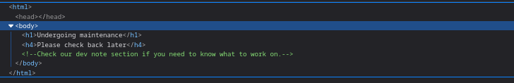

## DEVELOPMENT FOLDER

Dengan gobuster atau tools sejenisnya akan memperlihatkan bahwa ada sebuah endpoint dengan nama `development` yang memiliki dua file text

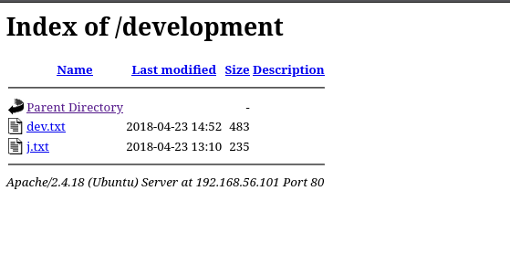 

Isi dari file `dev.txt` bisa dibaca di [sini](dev.txt)

Isi dari file `j.txt` bisa dibaca di [sini](j.txt)

> `J` dan `K` adalah bagian dari mesin ini, mungkin user?

## SAMBA ENUMERATION

Melakukan listing pada tools smbclient dengan perintah

```bash
smbclient -L <HOST> 
```

akan menampilkan list berikut

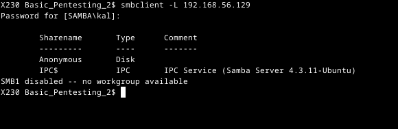

kemudian coba masuk ke share `Anonymous`, di dalam samba ada satu file bernama staff.txt

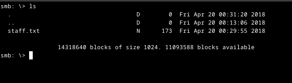 

ambil file tersebut dengan perintah `get staff.txt`. File staff txt bisa dibaca di [sini](staff.txt)

> untuk melakukan enumerasi secara otomatis, bisa menggunakan tools seperti enum 4 linux
> 
> 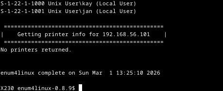
> 
> Username target telah diperoleh `kay` dan `jan`

## BRUTEFORCING ACCESS

Karena pada mesin ini port 22 / ssh terbuka, dan pada file `j.txt` `kay` memberitahu `jan` untuk segera mengganti password karena password `jan` yang mudah di crack. Bisakah kita melakukan bruteforce pada `jan`?

```bash
hydra -l jan -P rockyou.txt <IP> ssh
```

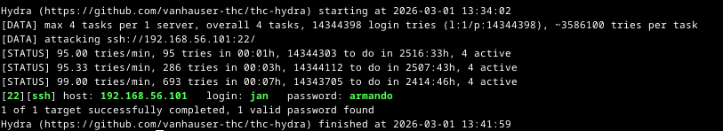

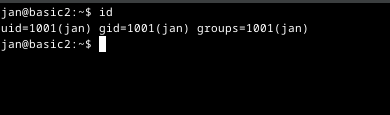

## PRIVILEGE ESCALATION & GAINING ROOT ACCESS

> Pada mesin ini ada 2 cara untuk mendapatkan akes root

User jan memiliki akses pada direktori `/home/kay` dan `kay` memiliki private key ssh `id_rsa`. Bisakah kita mengambil file tersebut dan crack id_rsa tersebut dengan tools `john the ripper`? 

```bash
# Ambil file id_rsa dan simpan pada directory home
scp jan@192.168.56.129:/home/kay/.ssh/id_rsa /home/kali

# Buat hash dengan ssh2john
ssh2john id_rsa > kay_id

# Crack kay_id dengan john
john --wordlist=Documents/SecLists-master/rockyou.txt kay_id    
```

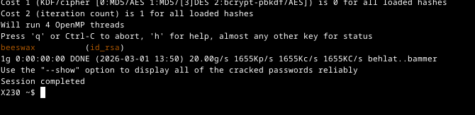

> jangan lupa beri akses supaya hanya user yang dapat membaca dan menulis ke file tersebut dengan `chmod 600`

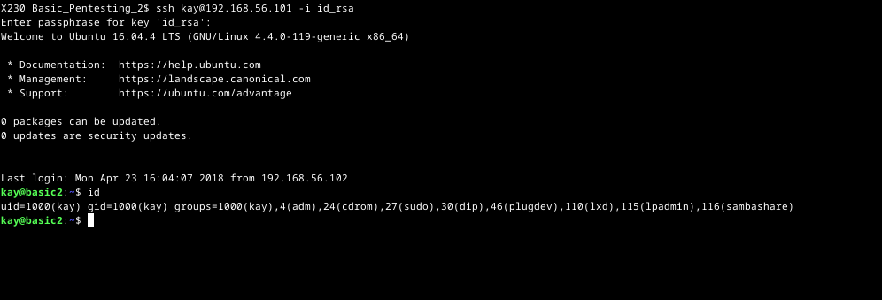

Password kay berada di direktori `/home/kay/pass.bak`

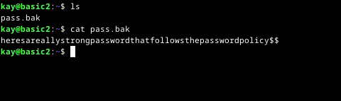

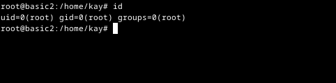

> Flag berada di `/root/flag.txt`
> 
> 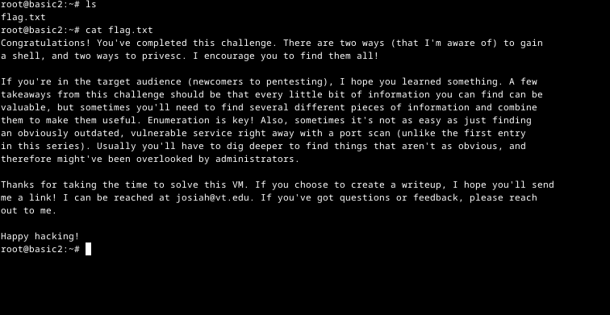


