# Planet: Earth CTF

[vulnhub_link](https://www.vulnhub.com/entry/blogger-1,675/))

## Ip finding

`fping -aqg 192.168.xxx.0/24`

> Note: you can use netdiscover

## Nmap Scan

| Port | State | Service |
|:----:|:-----:|:-------:|
| 22   | open  | ssh     |
| 80   | open  | http    |

## Http Server


## Web Enumeration

> You can use tools like dirbuster or ffuf if you like

```shell
gobuster dir -w your_wordlist.txt -u http://<YOUR_MACHINE_IP>/ -r html,php,txt -o gobuster.log
```

| assets     | Status: 301 |
|:----------:|:-----------:|
| css        | Status: 301 |
| images     | Status: 301 |
| index.html | Status: 200 |
| js         | Status: 301 |

Inside of /assets

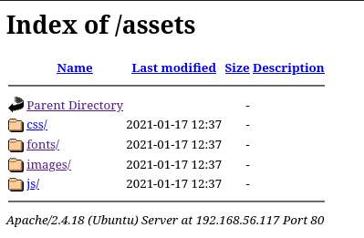

Exploring the fonts directory i found another directory name blog

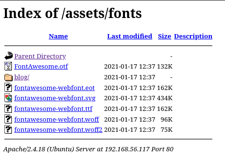

> in order to make the blog works, you need to add blogger.thm to /etc/hosts. (Read the description of blogger machine in vulnhub)

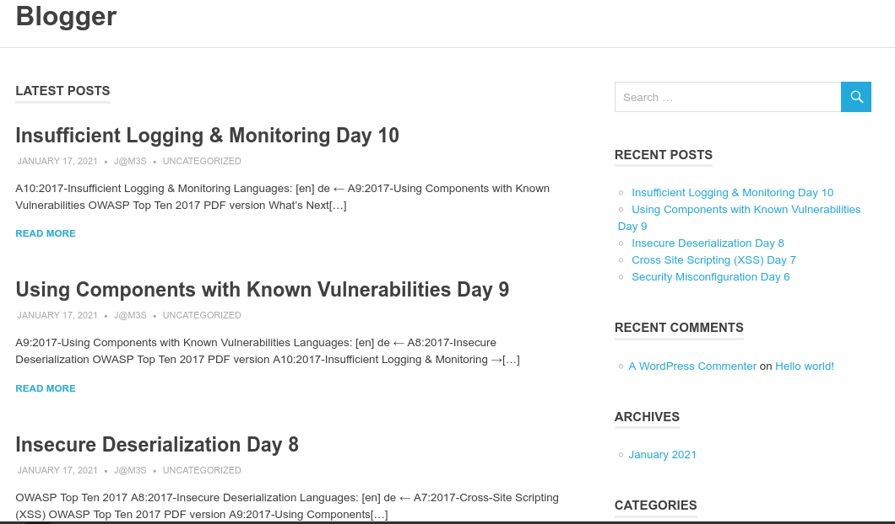

## File Upload Vulnerability

Clicking one of the article would give us this url

```html
http://blogger.thm/assets/fonts/blog/?p=29
```

scrolling down i found out that we can give comment with image attachment

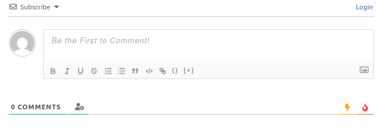

Upon seeing this maybe i can upload php file and get reverse shell?, the payload i use in this writeup are [here](https://github.com/pentestmonkey/php-reverse-shell), but uploading php file is not permited. I try to change the format to .jpg instead of .php and obviously it's not working. 

So i try to add gif format header "GIF87a;" to the reverse shell php files and now the php file is successfully uploaded

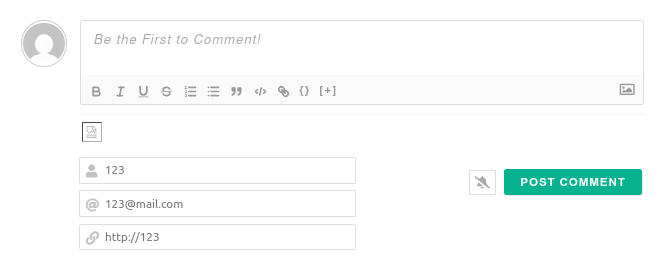

On the listener now i got the shell

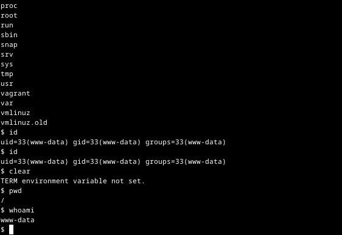

Entering the /home directory i see 3 user available

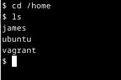

the user flag is on james folder, but when i try to cat the user.txt this occur

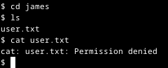

## Searching a Way Out To Get User and Root Flag

Since the machine has ssh port open, i try to bruteforce it with hydra and still not working because it does not support password authentication method. Running su command also not working because it need to run in a terminal environtment, from here i try to spawn shell by using python but first i need to know if this machine has python. In order to find out i ran this command

```shell
$ which python
$ which python3
/usr/bin/python3
```

and found out this machine use python3, so i spawn the shell using this command

```shell
python3 -c 'import pty; pty.spawn("/bin/bash")'
```

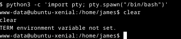

then i change the TERM environtment variable to xterm in order to get the full shell environtment

```shell
export TERM=xterm
```

now i can run su command in order to get access to one of the three account available,  the success login attempt are "vagrant" with the password "vagrant"

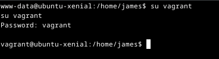

but i still can't cat the user.txt file. Maybe i need to become root first?, running 'sudo -l' command give me this

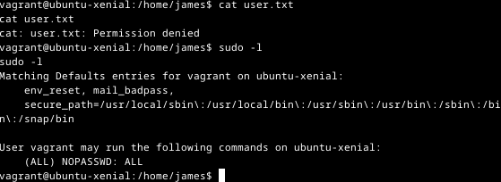

it bassicaly say that i can run anything with sudo without password needded, so i try to run the same cat command but with sudo

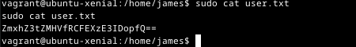

> Decode the flag from base 64 and you shall get the flag

now to get the root flag  just elevated the user to root by 'sudo su' command and acces the /root directory

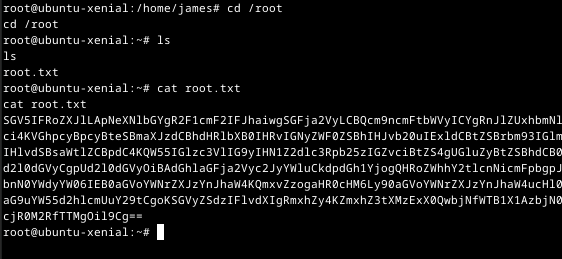
